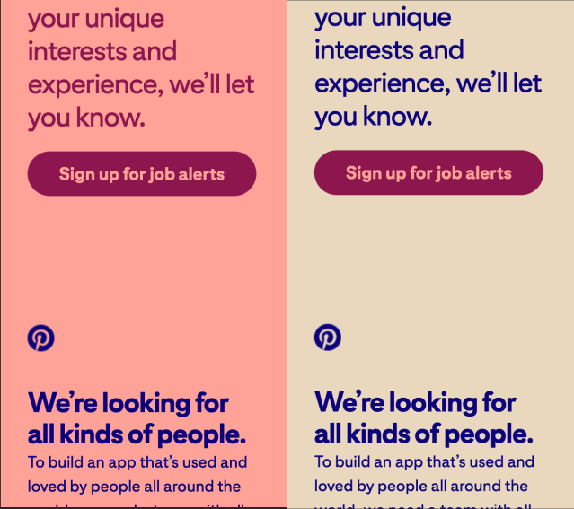

# Repository for [tabuchi.dev](https://tabuchi.dev)

## Learnings
### Run build on personal computer before pushing changes
My components folder was in the pages folder which works in development, but not when building the static pages. This was a breaking change and also costs server build time.

### Keep files tidy
SVG icons (around 7) are all kept in one file so they can be imported cleanly on one line and not existing as 7 separate files.

`import {LinkedinIcon, MailIcon, GithubIcon} from "./svgs";` instead of 3 separate lines of imports.

### Animations
GSAP is very cool and powerful. The background and font color changing effect worked easily because GSAP can annimate CSS variables, so I only needed to declare colors for everything once and then set up GSAP to trigger the color changes the root CSS variables and not have to tell GSAP to change the color of each different element.
e.g. Buttons have background and font colors swapped compared to what the default text has. GSAP would need to target and change them separately if it couldn't just change the CSS variables.

I thought GSAP could only affect CSS properties, but it can run callbacks after completing an animation and use JS to affect other changes. Before learning about the callbacks, I was considering having two buttons, one for up and one for down, and then toggling their visibility with GSAP. The callbacks allow me to change the click action of the scrolldown/up button when it hits the bottom/top of the page, so I only need one button. Much simpler.

### Design
I stole the design of my site from [PinterestCareers](https://www.pinterestcareers.com/). I copied their colors and idea of changing the background and font color with scrolling.
#### Improvements
Pinterest used CSS classes to change the style of their elements. I used CSS variables so I only have to change the two colors (background-color and font-color) instead of definining what each class should look like and all the elements that it affects. Pinterest used the code below (over 50 lines) just to define one theme (they have 17 and had to do this 17 times). They repeat each color 5 times, so they have to change the code in 5 places if they decide to go with a different color.
From what I can tell, the only reason to not use CSS variables is if you need to support Internet Explorer.

#### Pinterest Code
##### CSS
```css
  /********** color panes & associated font colors **********/
    /**** bright yellow bkg - purple text ****/
.color-yellow {background-color: #FFE086 !important;}
.color-yellow .post-content h1, .color-yellow .post-content h2, .color-yellow .post-content h3, .color-yellow .post-content p, .color-yellow .post-content li {color:#4900a7;}
.color-yellow .fusion-logo {filter: invert(12%) sepia(46%) saturate(7329%) hue-rotate(266deg) brightness(93%) contrast(128%);}
.color-yellow .fusion-main-menu li > a .menu-text:not(.xcc-wrapper),
.color-yellow .xcc-sign-in-parent > .xcc-sign-in,
.color-yellow .fusion-mobile-menu-icons a {color:#4900a7;}
.color-yellow .fusion-main-menu li.menu-findroles .menu-text {border-color:#4900a7;}
.color-yellow .fusion-mobile-menu-icons a:before,
.color-yellow #mobile-menu-main-menu a,
.color-yellow .fusion-mobile-nav-item .fusion-open-submenu,
.color-yellow .menu-dropdown .sign-in-link:after, .color-yellow .menu-dropdown .create-profile-link:after {color: #4900a7;}
              /** hover color flip **/
.color-yellow header:hover .fusion-logo {filter: invert(78%) sepia(55%) saturate(305%) hue-rotate(358deg) brightness(102%) contrast(101%);}
.color-yellow header:hover .fusion-main-menu li > a .menu-text:not(.xcc-wrapper),
.color-yellow header:hover .xcc-sign-in-parent > .xcc-sign-in,
.color-yellow header:hover .fusion-mobile-menu-icons a {color:#FFE086;}
.color-yellow header:hover .fusion-header.color-yellow,
.color-yellow .fusion-megamenu-holder {background-color:#4900a7 !important;}
.color-yellow header:hover .fusion-main-menu li > a .menu-text,
.color-yellow .fusion-megamenu-holder .fusion-megamenu-title a {color:#FFE086;}
.color-yellow .fusion-main-menu li.menu-findroles:hover .menu-text,
.color-yellow header:hover .fusion-main-menu li.menu-findroles .menu-text{border-color:#FFE086;}
.color-yellow header:hover .fusion-mobile-menu-icons a,
.color-yellow header:hover .fusion-mobile-menu-icons a:before,
.color-yellow header:hover #mobile-menu-main-menu a,
.color-yellow header:hover .fusion-mobile-nav-item .fusion-open-submenu,
.color-yellow header:hover .menu-dropdown .sign-in-link:after, .color-yellow header:hover .menu-dropdown .create-profile-link:after {color: #FFE086; text-decoration:none;}
```
##### Javascript
```javascript
// color scroll script full
function colorscroll(){
  $('.colorpane').each(function() { 
    $(this).css('background-color', 'transparent');
    if ($(this).hasClass('col-yel')) {$(this).attr('data-color','yellow');}
    if ($(this).hasClass('col-grn')) {$(this).attr('data-color','green');}
    if ($(this).hasClass('col-mnt')) {$(this).attr('data-color','mint');}
    if ($(this).hasClass('col-btr')) {$(this).attr('data-color','butter');}
    if ($(this).hasClass('col-crl')) {$(this).attr('data-color','coral');}
    if ($(this).hasClass('col-bge')) {$(this).attr('data-color','beige');}
    if ($(this).hasClass('col-prp')) {$(this).attr('data-color','purple');}
    if ($(this).hasClass('col-wht')) {$(this).attr('data-color','white');}
    if ($(this).hasClass('col-pnk')) {$(this).attr('data-color','pink');}
    if ($(this).hasClass('col-byel')) {$(this).attr('data-color','babyyellow');}
    if ($(this).hasClass('col-bgrn')) {$(this).attr('data-color','babygreen');}
    if ($(this).hasClass('col-bblu')) {$(this).attr('data-color','babyblue');}
    if ($(this).hasClass('col-gld')) {$(this).attr('data-color','gold');}
    if ($(this).hasClass('col-org')) {$(this).attr('data-color','orange');}
    if ($(this).hasClass('col-lil')) {$(this).attr('data-color','lilac');}
    if ($(this).hasClass('col-cer')) {$(this).attr('data-color','cerulean');}
    if ($(this).hasClass('col-cfl')) {$(this).attr('data-color','cornflower');}
  });
  
  $(window).scroll(function() {
  // selectors
  var $window = $(window),
      $body = $('body'),
      $panel = $('.colorpane');
      $navhdr = $('.fusion-header');
  
  // Change 33% earlier than scroll position so colour is there when you arrive.
  var scroll = $window.scrollTop() + ($window.height() / 3);
 
  $panel.each(function () {
    var $this = $(this);
    
    if ($this.position().top <= scroll && $this.position().top + $this.height() > scroll) {
          
      // Remove all classes on body with color-
      $body.removeClass(function (index, css) {
        return (css.match (/(^|\s)color-\S+/g) || []).join(' ');
      });
      $navhdr.removeClass(function (index, css) {
        return (css.match (/(^|\s)color-\S+/g) || []).join(' ');
      });
       
      // Add class of currently active div
      $body.addClass('color-' + $(this).data('color'));
      $navhdr.addClass('color-' + $(this).data('color'));
    }
  });    
  
}).scroll();

}
```

#### My code to do the same thing
##### CSS
```css
html {
  --color: #00116A;
  --background: #E4D3B9;
}
.main {
  background-color: var(--background);
  color: var(--color);
}
/* Everything inherits the background and color so I only need to define what's different,
   which is just the buttons and the SVG icons in the buttons */
.main button {
  color: var(--background);
  background-color: var(--color);
}
.main button:hover {
  background-color: inherit;
  color: inherit;
}
.main button svg {
  stroke: var(--background);
}
.main button:hover svg {
  stroke: var(--color);
}
```
##### Javascript
```javascript
// Have GSAP change the CSS variables when the next section comes in and
// reverse when it leaves, with a 100px gap/cushion
gsap.to("html", {
  "--background": colors["bg-green"],
  "--color": colors["font-yellow"],
  scrollTrigger: {
    trigger: "#prettywiki",
    start: "top 80%",
    end: "+=100",
    toggleActions: "none play none reverse",
  },
});
```

Pinterest's complex code also caused them to make a few mistakes. For some reason their buttons are not selected with the color class, so they do not update their color with the rest of the elements. Also, their last section updates background color, but not font color. See both issues in the screenshots below or go to [PinterestCareers](https://www.pinterestcareers.com/) and scroll down to see it yourself.


I really do like the design though (as I have copied the good parts in my website), and want to thank Pinterest for the design and also for not obfuscating their code like others do.